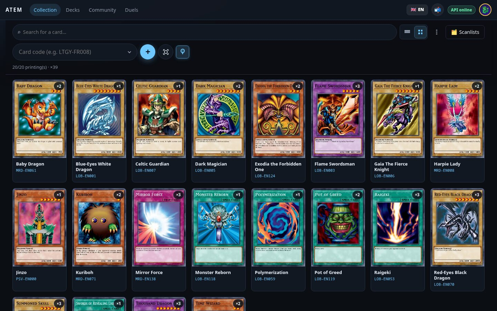
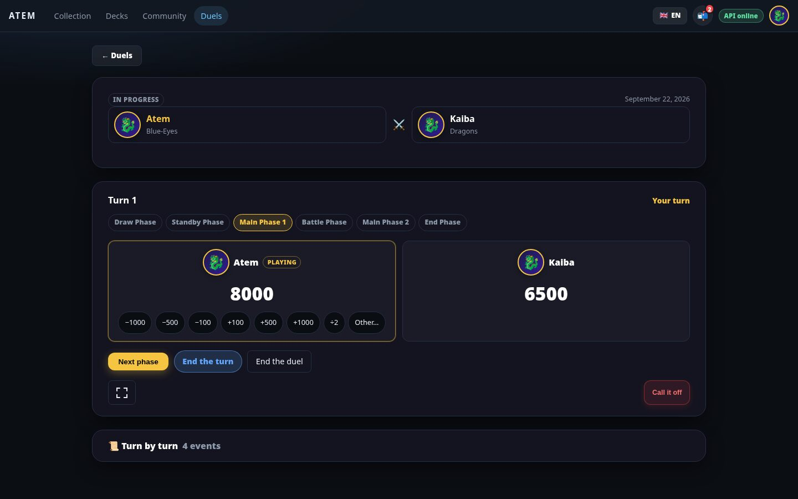
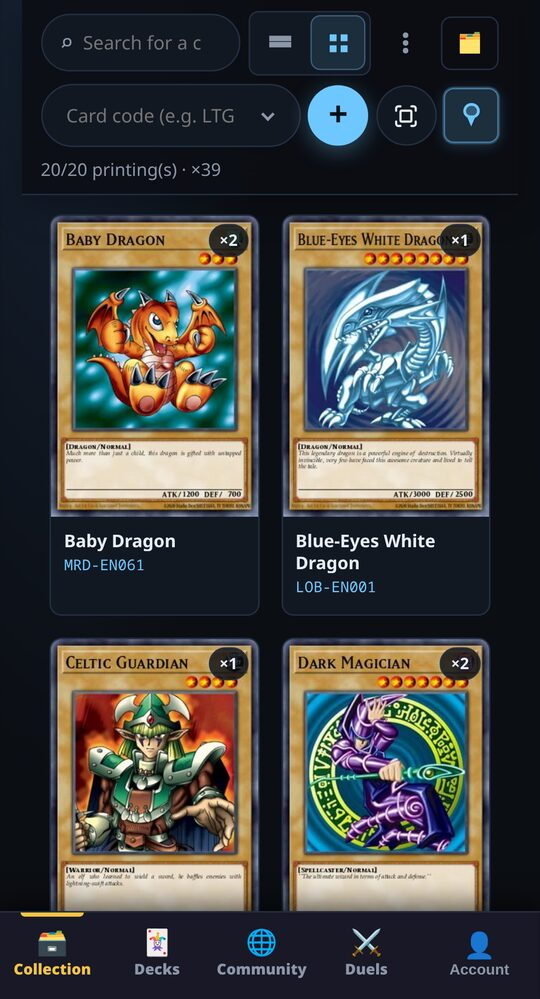
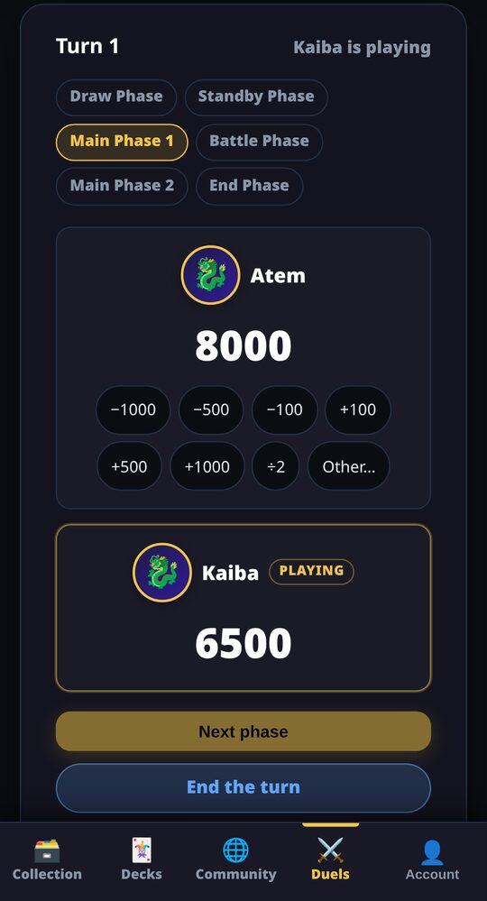

<p align="center">
  
</p>

# ATEM

A self-hosted web app for paper Yu-Gi-Oh! players: collection inventory, deck
building, friends, and a notebook for duels played at a real table.

ATEM never simulates the game's rules. Scope and non-goals:
[`docs/00-vision.md`](docs/00-vision.md).

<p align="center">
  
</p>
<p align="center">
  
  
  
</p>

## Features

- **Collection** — add cards by set code, typed or scanned with the phone's
  camera (on-device OCR); filter on every card property; scanlists to check a
  batch before adding it; CSV import and export (ATEM, ScanFlip, Cardmarket).
- **Decks** — built from the cards you own, banlist applied, sorted in folders.
- **Community** — the instance's players, friends, blocking, an inbox; each
  player chooses who sees their collection and decks.
- **Duels** — invite a friend, pick decks, flip the coin, track phases and life
  points from both phones, record the winner.
- **Administration** — one administrator, set in the configuration: open or
  closed registration, account management, an audit log.

French and English. Card data and artwork come from
[YGOPRODeck](https://ygoprodeck.com); ATEM downloads each artwork once and
serves it itself.

## Running an instance

With Docker or Podman:

```sh
mkdir atem && cd atem
curl -fsSLO https://raw.githubusercontent.com/Altagen/ATEM/main/compose.yaml
curl -fsSL https://raw.githubusercontent.com/Altagen/ATEM/main/.env.example -o .env
# Set JWT_SECRET, POSTGRES_PASSWORD, ATEM_ADMIN_EMAIL, ATEM_ADMIN_PASSWORD in .env.

docker compose pull && docker compose up -d
docker compose exec api node dist/modules/referential/sync.js   # card catalogue, once
```

ATEM listens on port 8080. Beyond `localhost`, serve it over HTTPS behind a
reverse proxy: the session cookie is `Secure`, and browsers only open the
camera on secure pages. Configuration, HTTPS, backups and upgrades:
[`docs/deployment.md`](docs/deployment.md).

## Development

```sh
./scripts/dev-db.sh up        # PostgreSQL
pnpm install
pnpm --filter @atem/api db:migrate
pnpm dev                      # front on :5173, API on :3000
```

Set-up, tests and gates: [`docs/development.md`](docs/development.md).
Releases: [`docs/releasing.md`](docs/releasing.md).

## Documentation

| Document | Content |
|---|---|
| [`00-vision.md`](docs/00-vision.md) | Scope, personas, non-goals |
| [`01-domain-model.md`](docs/01-domain-model.md) | The domain model |
| [`02-architecture.md`](docs/02-architecture.md) | Architecture decisions |
| [`03-roadmap.md`](docs/03-roadmap.md) | Milestones and what each measured |
| [`04-structure.md`](docs/04-structure.md) | Module boundaries and conventions |
| [`05-deferred.md`](docs/05-deferred.md) | Paused, kept and rejected ideas |
| [`deployment.md`](docs/deployment.md) | Configuration, HTTPS, backups, upgrades |
| [`development.md`](docs/development.md) | Set-up, tests, gates |
| [`releasing.md`](docs/releasing.md) | Branches, versions, tags, images |
| [`ref-csv-formats.md`](docs/ref-csv-formats.md) | Import and export formats |
| [`ref-duels.md`](docs/ref-duels.md) | What a duel is here, and is not |
| [`ref-ocr.md`](docs/ref-ocr.md) | Scanner settings and measurements |

Security: [`SECURITY.md`](.github/SECURITY.md). Changes:
[`CHANGELOG.md`](CHANGELOG.md).

## Two rules

**Never fabricate data.** No invented fallback, no demo content when a request
fails. An empty screen is information; a plausible wrong one is not.

**No prose status file.** State is measured by executable gates, not written
in a document.

## License

[GNU Affero General Public License v3.0](LICENSE): anyone running a modified
version as a service must offer its source to its users.
